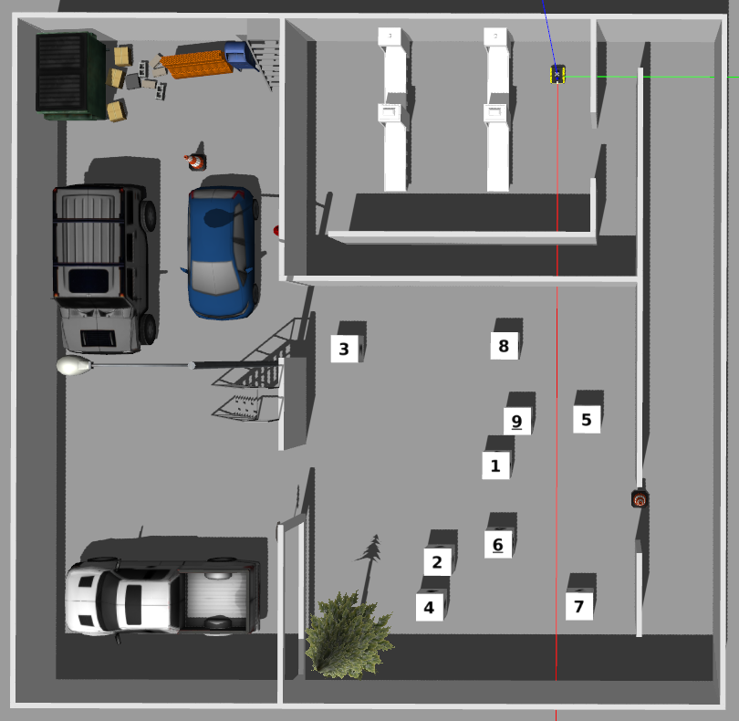

# ME5413_Final_Project

NUS ME5413 Autonomous Mobile Robotics Final Project
> Authors: [Christina](https://github.com/ldaowen), [Yuhang](https://github.com/yuhang1008), [Dongen](https://github.com/nuslde), and [Shuo](https://github.com/SS47816)
> 
> Co-Authors : [ikun](https://github.com/ccoopq) and his group mates



## Dependencies

* System Requirements:
  * Ubuntu 18.04
  * ROS Melodic
  * C++11 and above
  * CMake: 3.0.2 and above
* This repo depends on the following standard ROS pkgs:
  * `roscpp`
  * `rospy`
  * `rviz`
  * `std_msgs`
  * `nav_msgs`
  * `geometry_msgs`
  * `visualization_msgs`
  * `tf2`
  * `tf2_ros`
  * `tf2_geometry_msgs`
  * `pluginlib`
  * `map_server`
  * `gazebo_ros`
  * `jsk_rviz_plugins`
  * `jackal_gazebo`
  * `jackal_navigation`
  * `velodyne_simulator`
  * `teleop_twist_keyboard`
* And this [gazebo_model](https://github.com/osrf/gazebo_models) repositiory

## Installation

Containing rospkgs:

* `interactive_tools` are customized tools to interact with gazebo and your robot
* `jackal_description` contains the modified jackal robot model descriptions
* `me5413_world` the main pkg containing the gazebo world, and the launch files
* Other pkgs are optional based on youe own environment

```bash
# Clone your own fork of this repo (assuming home here `~/`)
cd
git clone https://github.com/<YOUR_GITHUB_USERNAME>/ME5413_Final_Project.git
cd ME5413_Final_Project

# Install all dependencies
rosdep install --from-paths src --ignore-src -r -y

# Build
catkin_make
# Source 
source devel/setup.bash
```

To properly load the gazebo world, you will need to have the necessary model files in the `~/.gazebo/models/` directory.

There are two sources of models needed:

* [Gazebo official models](https://github.com/osrf/gazebo_models)
  
  ```bash
  # Create the destination directory
  cd
  mkdir -p .gazebo/models

  # Clone the official gazebo models repo (assuming home here `~/`)
  git clone https://github.com/osrf/gazebo_models.git

  # Copy the models into the `~/.gazebo/models` directory
  cp -r ~/gazebo_models/* ~/.gazebo/models
  ```

* [Our customized models](https://github.com/NUS-Advanced-Robotics-Centre/ME5413_Final_Project/tree/main/src/me5413_world/models)

  ```bash
  # Copy the customized models into the `~/.gazebo/models` directory
  cp -r ~/ME5413_Final_Project/src/me5413_world/models/* ~/.gazebo/models
  ```

## Usage

### 0. Gazebo World

This command will launch the gazebo with the project world

```bash
# Launch Gazebo World together with our robot
roslaunch me5413_world world.launch
```

### 1. Manual Control

If you wish to explore the gazebo world a bit, we provide you a way to manually control the robot around:

```bash
# Only launch the robot keyboard teleop control
roslaunch me5413_world manual.launch
```

### 2. Mapping

After launching **Step 0**, in the second terminal:

Here provide two mapping methods

1. cartographer with odom and IMU
```bash
# Launch cartographer
roslaunch me5413_world demo_revo_sc_imu.launch
```
2. GMapping (Origin)
```bash
# Launch GMapping
roslaunch me5413_world mapping.launch
```
After finishing mapping, run the following command in the thrid terminal to save the map:

```bash
# Save the map as `my_map` in the `maps/` folder
roscd me5413_world/maps/
rosrun map_server map_saver -f my_map map:=/map
```
Following is the mapping result of cartographer with odom and IMU.


### 3. Navigation

Once completed **Step 2** mapping and saved your map, quit the mapping process.

Here TEB(Timed Elastic Band) is applied.

```bash
roslaunch me5413_world navigation.launch
```
Below are the result images for three different targets:
<p align="center">
  
  
  
</p>

#### Box Detect
Because the Box in the map is randomly generated and we do not know the location of the Box in advance, Jackal needs to search for the Box in a certain area and use visual detection to obtain the Box's location.

We use the API provided by Huawei Cloud in Python to train the digital recognition model, and generate the next target position based on the position and size information of the object frame, and communicate with the main program through Python-ROS.

For specific detection and location generation steps, see 'img_process/README.md'.


## Contribution

You are welcome contributing to this repo by opening a pull-request

We are following:

* [Google C++ Style Guide](https://google.github.io/styleguide/cppguide.html),
* [C++ Core Guidelines](https://isocpp.github.io/CppCoreGuidelines/CppCoreGuidelines#main),
* [ROS C++ Style Guide](http://wiki.ros.org/CppStyleGuide)

## License

The [ME5413_Final_Project](https://github.com/NUS-Advanced-Robotics-Centre/ME5413_Final_Project) is released under the [MIT License](https://github.com/NUS-Advanced-Robotics-Centre/ME5413_Final_Project/blob/main/LICENSE)# ME5413_Final
